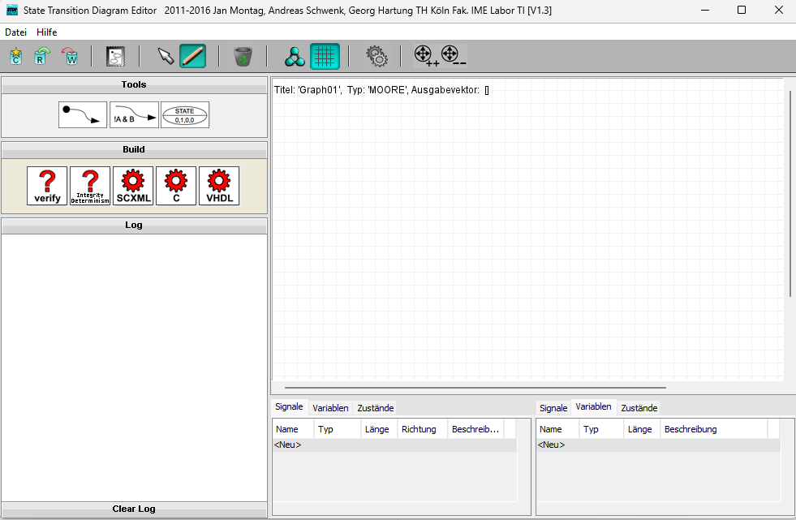
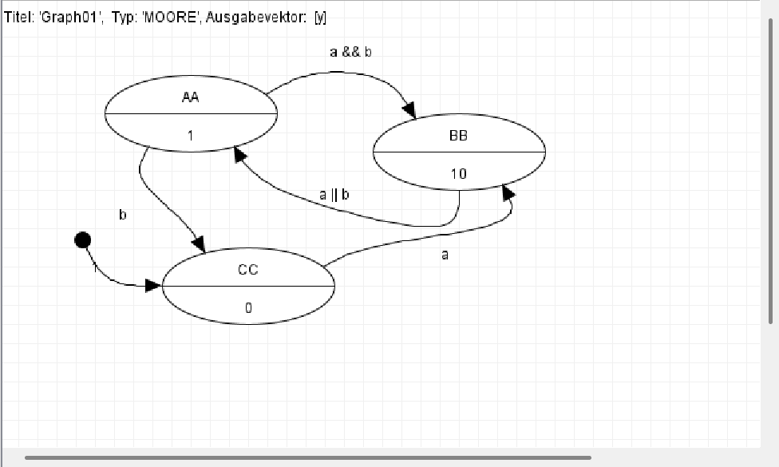

# FSM - OneWare Studio Backend for finite state machines
The FSM project uses the STDM developed at TH Köln as its backend and basis. 
The STDE is a graphical editor for creating automata that can also generate VHDL and C code. 
For more information on the original STDE, see the STDE chapter.

When used as a backend, the project is to be rewritten so that it can read the SCXML format already in 
use and validate the automaton from this configuration once, then export the automaton in C, VHDL and Verilog. 
This is all part of the OneWare Studio integration of this project.

## STDE - State Transition Diagram Editor
The STDE was developed by Andreas Schwenk and Jan Montag under the supervision of Prof. Dr. Georg Hartung.
The original software can be found in the author's [repository](https://github.com/andreas-schwenk/stde-classic).
The original functions are still available via a Java Swing UI and can still be used.



In this GUI, a Moore or Mealy automaton can be created. 
This is checked for logical consistency and can then be exported as VHDL or C code as well as in XML format.



### VHDL export Moore-Automat
```vhdl
-- Graph01

library ieee;
use ieee.std_logic_1164.all;
use ieee.numeric_std.all;

entity GRAPH01 is
    port
    (
        CLK   : in    std_logic;                           -- clock
        RESET : in    std_logic;                           -- reset
        A     : in    std_logic;                           -- x
        B     : in    std_logic;                           -- x
        Y     : out   signed(15 downto 0)                  -- x
    );
end GRAPH01;

architecture BEHAVE of GRAPH01 is

    -- define state-type
    type TSTATE is
    (
        AA, -- 
        BB, -- 
        CC  -- 
    );
    signal CURRENT_STATE, NEXT_STATE : TSTATE;
    constant RESET_STATE : TSTATE := CC;

begin

    NEXT_STATE <=
        BB when CURRENT_STATE = AA and ((A='1') and (B='1')) else
        CC when CURRENT_STATE = AA and ((B='1')) else
        AA when CURRENT_STATE = BB and ((A='1') or (B='1')) else
        BB when CURRENT_STATE = CC and ((A='1')) else
        CURRENT_STATE;

    process(CLK, RESET, NEXT_STATE) is
    begin
        if RESET='1' then
            CURRENT_STATE <= RESET_STATE;
        elsif CLK'event and CLK='1' then
            CURRENT_STATE <= NEXT_STATE;
        end if;
    end process;

    -- OUTPUT-FUNCTION
    y <=
        1 when (CURRENT_STATE = AA) else
        2 when (CURRENT_STATE = BB) else
        0;

end BEHAVE;
```

## Authors & Contributors

The original software can be found in the author's [repository](https://github.com/andreas-schwenk/stde-classic).
Many thanks to Andreas Schwenk for publishing his software.

### Initial Development - STDE
* **Andreas Schwenk** – Original Concept & Initial Implementation
* **Jan Montag** - Original Concept & Initial Implementation
* **Prof. Dr. Georg Hartung** (TH Köln) Project Lead

### Extensions & Maintenance - FSM-Backend
* **Prof. Dr. Georg Hartung** (TH Köln) – Simulation Extensions (SYP-Project 2018)
* **Sebastian Wittlich** (TH Köln - FEntwumS) – Integration & Current Maintenance
* **Tobias Krawutschke** (TH Köln - FEntwumS) – Project Lead
* **Tunc Koldas** – Bachelor Thesis / OneWare Studio Integration 

---
*A special thanks to the students and researchers who have contributed to STDE over the years.*
